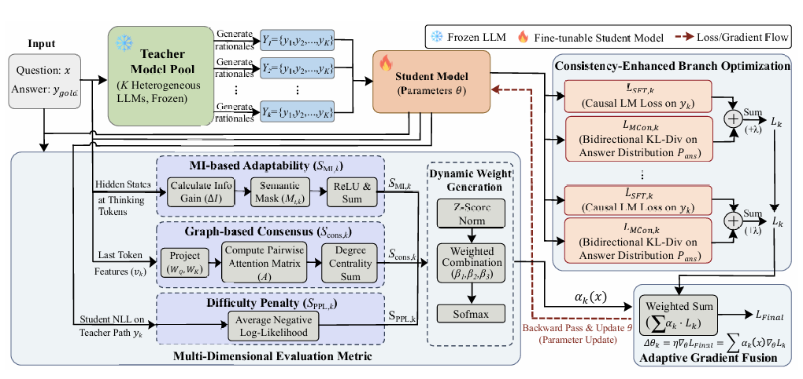

## Overview

Combining complementary teachers through student-aware supervision for more effective reasoning distillation.

Accepted to **IJCAI 2026**. Jin Cui and Jiaqi Guo contributed equally.

[Read the paper](https://arxiv.org/abs/2601.13992) · [Download PDF](https://arxiv.org/pdf/2601.13992)
