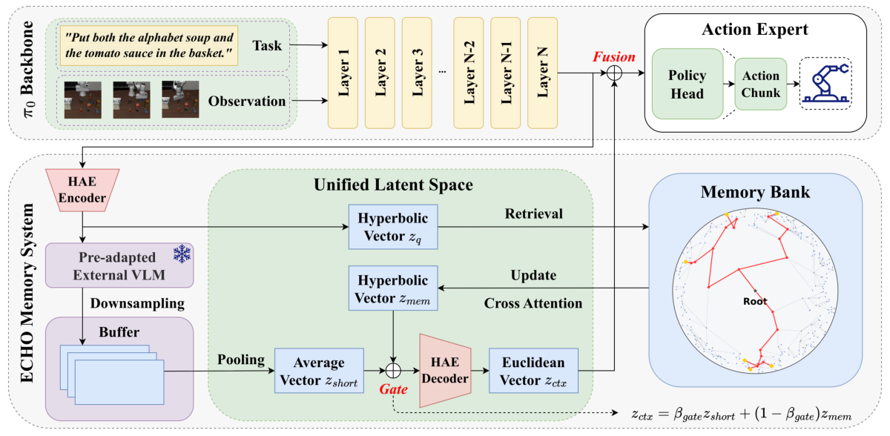

## Overview

Organizing robot experiences in a continuous hierarchical memory to support retrieval and generalization in long-horizon tasks.

**NeurIPS 2026 · Accepted.**

[Read the paper](https://arxiv.org/abs/2605.10993) · [Download PDF](https://arxiv.org/pdf/2605.10993)
