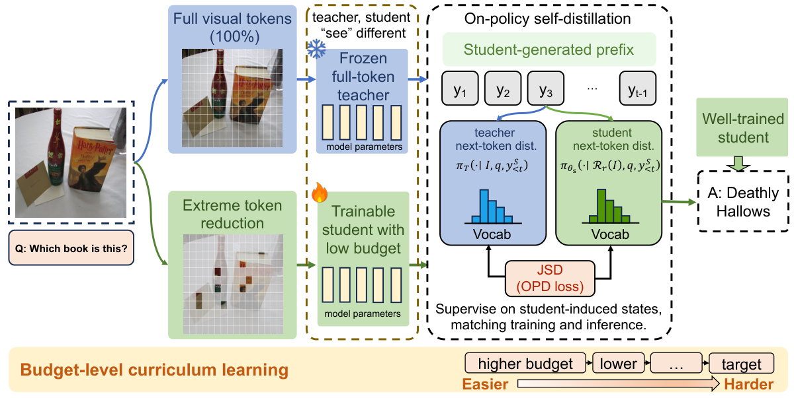

## Overview

Recovering multimodal capabilities under extreme visual-token reduction through on-policy self-distillation and a progressive token-budget curriculum.

**arXiv 2026 · Preprint.**

[Read the paper](https://arxiv.org/abs/2609.32353) · [Download PDF](https://arxiv.org/pdf/2609.32353) · [Code](https://github.com/Yrxxxxxxxx1007/LT-OPD)
