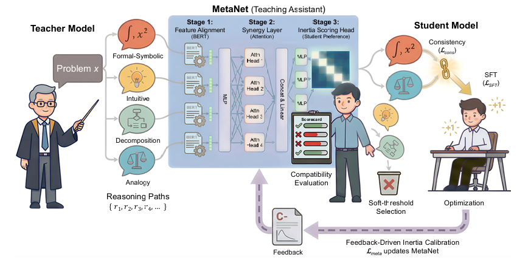

## Overview

Aligning diverse reasoning perspectives with the student's evolving capabilities to move beyond passive imitation.

**ACL 2026 · Main Conference · Long Paper.**

[Read the paper](https://aclanthology.org/2026.acl-long.2020/) · [Download PDF](https://aclanthology.org/2026.acl-long.2020.pdf)
